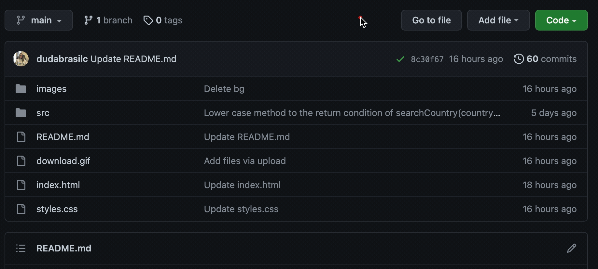
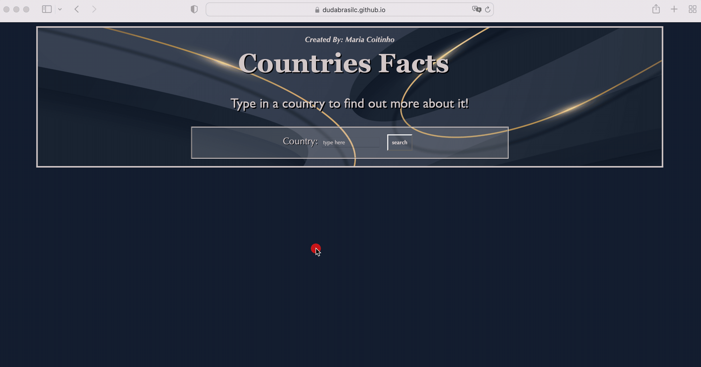
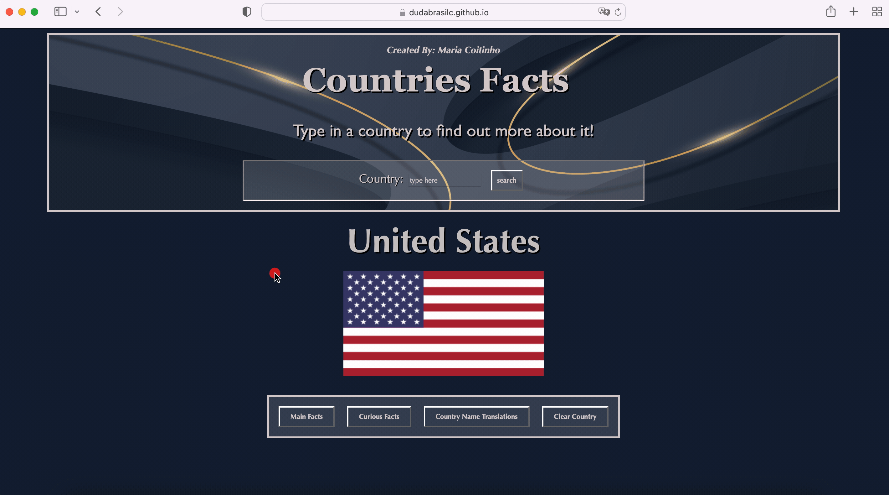

# Countries Facts

Countries Facts is a single page web application which you can use to search a country and find out facts about it.

## Description

This project contains an HTML file linking a CSS and JavaScript files, which contribute for the style and functionality of the web page.  
To have direct access to the webpage, just click on the link:  
https://dudabrasilc.github.io/countries-facts-project/. 
  
If you would like to download the files from the project, just click on Code and Download ZIP:  

### Searching up a country
The first step of the application is to type in a country that you would like to know more about.  
Once you are on the web page application, you will see an empty form. Just click on the form's empty space, type in a country and click the search button:  

  
### Checking country's Main Facts
Now to check the country's Main Facts you just have to click on the "Main Facts" button of the nav bar under the flag:  

## Usage

Add
Use examples liberally, and show the expected output if you can. It's helpful to have inline the smallest example of usage that you can demonstrate, while providing links to more sophisticated examples if they are too long to reasonably include in the README.

## Support

Add
Tell people where they can go to for help. It can be any combination of an issue tracker, a chat room, an email address, etc.

## Contributing

Add
Pull requests are welcome. For major changes, please open an issue first to discuss what you would like to change.

Please make sure to update tests as appropriate.

## License
Add
