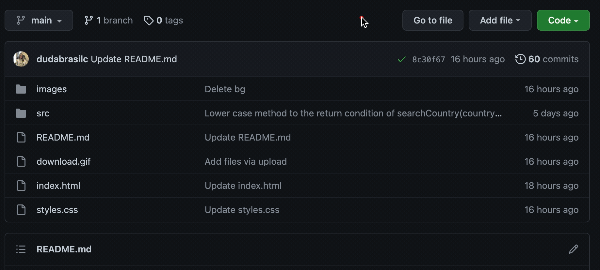
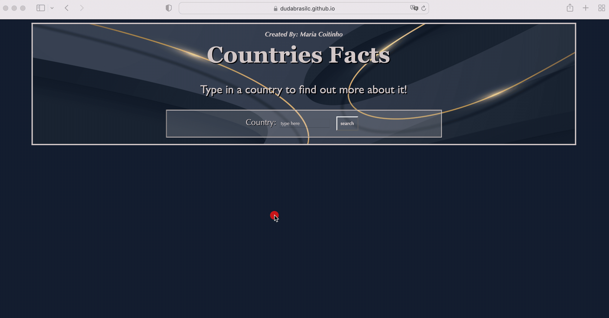
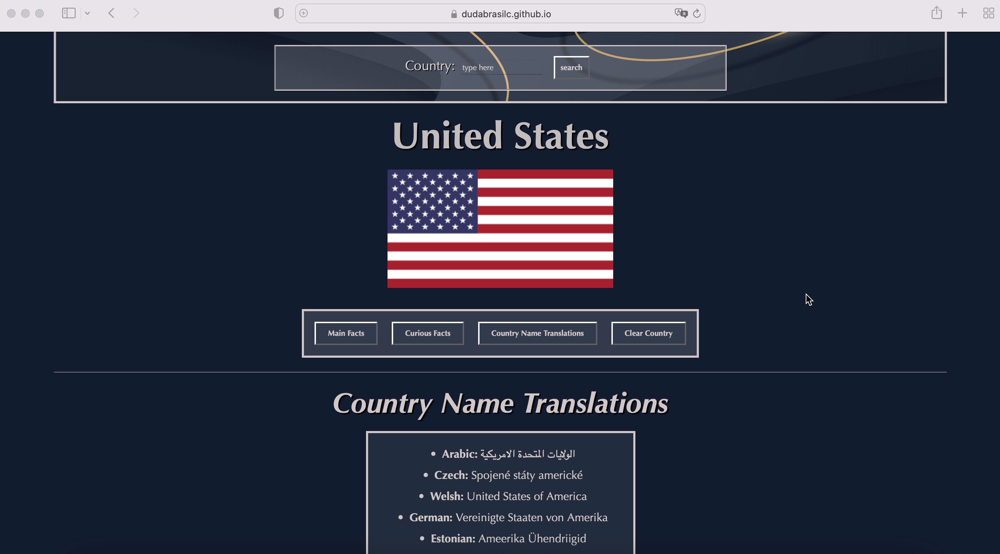
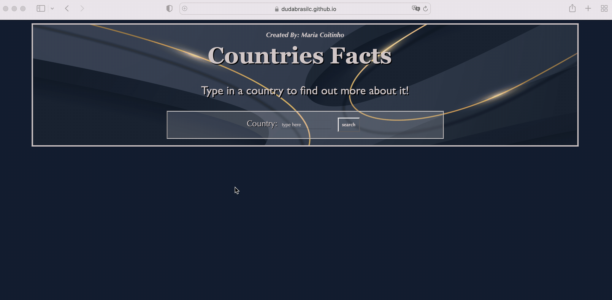

# Countries Facts

Countries Facts is a single page web application which you can use to search up a country and find out facts about it.
  
## Usage
This project contains an HTML file linking a CSS and JavaScript files, which contribute for the style and functionality of the web page.
  
To have direct access to the webpage, just click on the link:
https://dudabrasilc.github.io/countries-facts-project/.
  
If you would like to download the files from the project, click on Code and Download ZIP:  

  
For a walkthrough of the project web page, check out the YouTube video:
https://www.youtube.com/watch?v=gZzgUyicv5M.
  
### Searching up a country
The first step of the application is to type in a country that you would like to know more about. The data base contains 250 countries which you can search from!
  
Once you are on the web page application, you will see an empty form. Just click on the form's empty space, type in a country and click the search button. 
Note: The form's search input is not case sensitive!
  

  
  
### Checking country's Main Facts
Now to check the country's Main Facts, click on the "Main Facts" button on the nav bar under the flag:  
  

  
  
### Curious Facts and Country Name Translations
There are two other features that gives you information about the country you are searching for, they are: "Curious Facts" and "Country Name Translations". 
  
Note: The translations are available in 22 different languages!
  
The two buttons are also available on the nav bar rendered under the country's flag, as shown below:
  

  
  
### Clear Country
If you would like to clear up the current country to start a new search, click on the last nav bar button "Clear Country":
  

  
  
### Not Listed Country
In the case that a country is not listed, you will have the "Not Listed" output:
  

  
If you get that output, first check for any misspelling.
  
Note: The country search input is based on the common name of a country, not it's official name.
  
  
## Support
For any questions related to the project's functionality, code, or usage, please reach out to:  
brasildu@gmail.com
